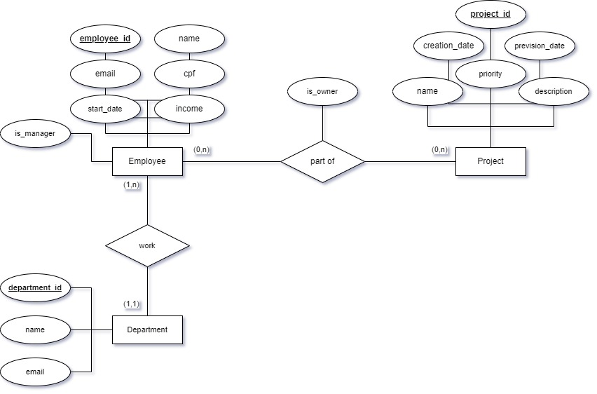
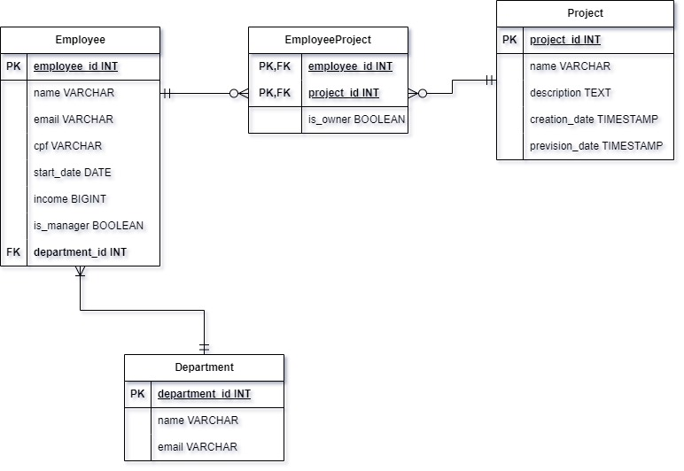

# Orla: Desafio Backend Java

Esse projeto é a resolução do desafio de backend Java proposto pela Orla,
onde foi solicitado um CRUD parcial de dois recursos principais: funcionários
e projetos.

## Índice

- [Tecnologias Utilizadas](#tecnologias-utilizadas)
- [Executando o projeto](#executando-o-projeto)
- [Testes](#testes)
- [Modelagem do banco](#modelagem-do-banco)
- [API](#api)
  - [POST `/departments`](#post-departments)
  - [GET `/departments`](#get-departments)
  - [POST `/employees`](#post-employees)
  - [GET `/employees`](#get-employees)
  - [POST `/projects`](#post-projects)
  - [GET `/projects`](#get-projects)
  - [GET `/projects/{id}`](#get-projectsid)

## Tecnologias Utilizadas

- Java 21
- Gradle 8.8
- Spring Boot
- Spring Data JPA
- PostgreSQL
- JUnit 5
- H2 Database
- Docker

## Executando o projeto

Existem três maneiras de executar o projeto localmente:

1. Utilizando uma IDE

Com uma IDE como IntelliJ, é fácil executar
o projeto pela classe principal do projeto `com.ethamorim.orlachallengebackend.OrlaChallengeBackendApplication`


2. Executando o `.jar`

Para isso, basta executar a tarefa `build` do Gradle no terminal:

```
./gradlew build
```

Esse comando irá gerar um diretório `/build` no root do projeto.
Em `/build/libs/` estará o arquivo `.jar` necessário para
executar o projeto. Sendo assim, basta escrever no terminal:

```
java -jar .\build\libs\orla-challenge-backend-0.0.1-SNAPSHOT.jar
```

> OBS.: Para as duas maneiras acimas funcionarem, é preciso que exista
> uma instância do PostgreSQL rodando localmente na porta padrão (5432),
> além de um banco de dados chamado `orla_challenge`.
> 
> Caso queira utilizar as próprias configurações, será preciso alterar
> o arquivo `application.properties` no diretório `src/main/resources/`.

3. Utilizando Docker

Com a aplicação conteinerizada, não é preciso de nenhuma configuração
adicional para executar o projeto. Tendo o Docker e Docker Compose instalado
na máquina, basta rodar o comando:

```
docker compose up --build
```

Uma imagem do PostgreSQL será puxada e os conteineres serão criados.
Em alguns segundos é esperado que o servidor TomCat esteja rodando no conteiner.

## Testes

Existem testes unitários e de integração no projeto. Testes são executados
quando a tarefa `build` do Gradle é usada, porém, caso queira se certificar
que os testes estão passando, basta utilizar o comando no terminal:

````
./gradlew test
````

O test de integração em `src/test/java/com/ethamorim/orlachallengebackend/ProjectIntegrationTest.java`
também serve como um exemplo de como as APIs devem funcionar.

## Modelagem do banco

Para esse projeto, foi modelado um banco de dados simples com três
entidades principais: `Employee`, `Project` e `Department`, representando
Funcionários, Projetos e Departamentos, respectivamente.



Um departamento pode ter vários funcionários associados a ele, porém
um funcionário estará associado a apenas um departamento, podendo ser
ou não o gerente do departamento.

Um projeto, por sua vez, pode possuir vários funcionários associados a ele
(membros ou contribuintes de um projeto), e funcionários podem participar
de um ou mais projetos. O funcionário pode ou não ser o dono do projeto,
ou seja, quem o criou.

Abaixo está uma representação da modelagem lógica:



## API

Foi desenvolvido um CRUD parcial, buscando se adequar à arquitetura RESTful,
para cada recurso identificado. Elas serão apresentadas em ordem gradual, 
visto que inicialmente o banco de dados não terá registros.

### POST `/departments`

Cria um novo registro de departamento. O corpo do request deve conter:

- `name`: Nome do departamento
- `email`: Email do departamento

Exemplo:
    
```json
{
    "name": "IT",
    "email": "it@test.com"
}
```

É esperado receber um status `201 Created` e um corpo de resposta com o
novo registro criado, contendo seu `id`.

### GET `/departments`

Retorna todos os registros de departamentos no banco.

### POST `/employees`

Cria um novo registro de funcionário. O corpo do request deve conter:

- `name`: Nome do funcionário
- `email`: Email do funcionário
- `cpf`: CPF do funcionário
- `startDate`: Data de início do funcionário
- `income`: Salário do funcionário
- `isManager`: Se o funcionário é gerente do departamento, ou não
- `departmentId`: ID do departamento ao qual o funcionário pertence
- `departmentEmail`: Email do departamento ao qual o funcionário pertence

`departmentId` e `departmentEmail` são excludentes, então apenas um é necessário.

Exemplo de corpo da requisição:

```json
{
    "name": "Orlando",
    "email": "orlando@test.com",
    "cpf": "12312312321",
    "startDate": "2024-08-03",
    "income": 12000,
    "isManager": true,
    "departmentEmail": "it@test.com" 
}
```

Caso o departamento não exista, será retornado um status `404 Not Found` e
o funcionário não será criado.

Caso o departamento exista e nenhum outro campo seja inválido, a resposta retornará
com status `201 Created`.

### GET `/employees`

Retorna todos os registros de funcionários no banco, com seus respectivos `id` 
e os departamentos associados a eles.

### POST `/projects`

Cria um novo registro de projeto. O corpo do request deve conter:

- `name`: Nome do projeto
- `description`: Descrição do projeto
- `startDate`: Data de início do projeto
- `previsionDate`: Data de término prevista do projeto
- `ownerId`: ID do funcionário que criou o projeto
- `ownerEmail`: Email do funcionário que criou o projeto
- `members`: Lista de emails dos funcionários que participam do projeto

Assim como em `POST /employees`, `ownerId` e `ownerEmail` são excludentes, então apenas um é necessário.

Contudo, `members` é uma lista apenas de emails, e todos os emails devem ser válidos e pertencer a funcionários.

Exemplo de corpo da requisição:

```json
{
    "name": "Papelzinho",
    "description": "Organize amigos secretos de forma simples",
    "startDate": "2024-08-03",
    "previsionDate": "2025-12-31",
    "ownerEmail": "orlando@test.com",
    "members": []
}
```

As datas devem seguir o padrão ISO `ano-mês-dia` (`yyyy-MM-dd`).

A lista de membros pode estar vazia ou completamente omitida, porém, caso esteja
preenchida e algum email não seja válido, será retornado um status `404 Not Found`.

O dono do projeto também é verificado, então se `ownerId` ou `ownerEmail` seja inválido,
será retornado um status `404 Not Found`.

Caso não exista entradas inválidas, o projeto será criado e sua referência
será usada para preencher os membros do projeto. Assim, tanto o dono quanto
os funcionários na lista `members` serão adicionados à associação `EmployeeProject`
(ou `employees_projects` no banco de dados). Deve-se esperar uma resposta
com status `201 Created` e um corpo com o registro do novo projeto criado,
assim como seus membros.

### GET `/projects`

Retorna todos os registros de projetos do banco, com seus respectivos `id` e
funcionários associados a ele.

### GET `/projects/{id}`

Retorna um único projeto, contanto que o `id` referencie um projeto existente,
assim como os funcionários associados a ele.